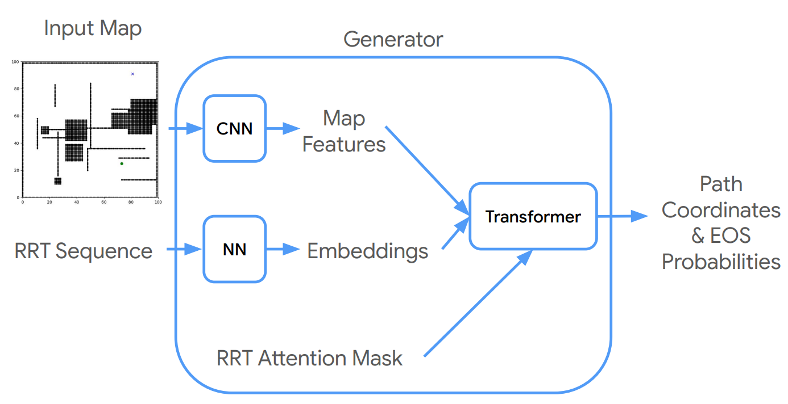
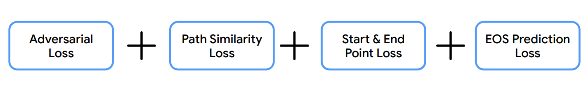
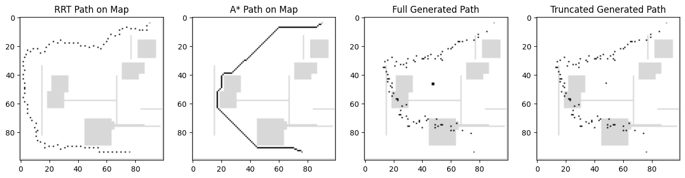

# plan2plan

## Description

A GAN (Generative Adversarial Network) model for generating more optimal paths that closely resemble those produced by the A* algorithm when conditioned on a 2D obstacle map and an initial RRT (Rapidly-exploring Random Tree) path.

## Model Architecture

### Generator Architecture:

### Loss Function:

## Results

## Usage

To collect 2D RRT and A* plans generated on random environments with random start and end goal positions, please refer to the script located at `PathPlanning/collect_data.py`. For details on the training pipeline, see the `Modeling/Plan2Plan_Transformer.ipynb` script.

